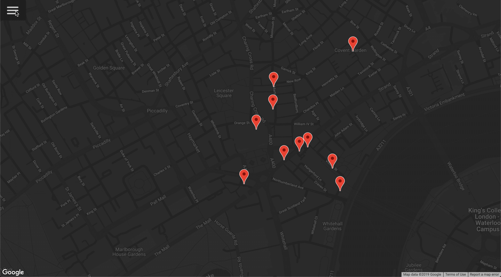

# Chingu Solo Project - Tier 2 - Mapbox API

## Overview

This project helps you gain experience in using API's to enhance the value
your applications provide to their users. Your objective with this project is 
to build a web application using the Mapbox API to build a map of a city of 
your choice.

## About Chingu

If you aren’t yet a member of Chingu we invite you to join us. We help our 
members transform what they’ve learned in courses & tutorials into the 
practical experience employers need and want.

Our remote team projects let you refine your technical skills and put them 
into practice while gaining new “soft” skills like communication, 
collaboration, and Agile project management. The types of skills that 
help real-world teams get things done!

You can learn more and join us at [chingu.io](https://chingu.io).

## Instructions

General instructions for all Solo Projects are located in the 
[Chingu Library](https://voyage.docs.chingu.io/prework/howwork). For detailed 
requirements, please checkout the following.

### Requirements

*Structure*
- [ ] Read over the Mapbox API documentation

      Topics to look for in the [Mapbox API](https://docs.mapbox.com/api/) documentation:
      - API endpoint
      - Setting up an API token
      - Setting up a request aka limits to the returned result, etc
      - How to query only for the exact info you need.

- Setup your parent component containing at least the following:
  - [ ] Navigation (or a button to toggle the sidebar)
  - [ ] Sidebar
  - [ ] Map
- Create a sidebar with the following elements:
  - [ ] Search input field
  - [ ] A list of search results (should match the markers on the map)
  - [ ] A button to toggle the display/hide of the sidebar
- Create a map component to contain the map of your city and location markers

*Style*
- [ ] You may use any style you choose. However, it should be consistent (e.g.
font, font size, color scheme, layout, etc.).
  - See [Consistent Web Design](https://1stwebdesigner.com/consistent-web-design/)
  - See [Why is consistency important in Web Design?](https://laceytechsolutions.co.uk/blog/importance-of-consistency-in-web-design/)

*Functionality*
- Sidebar behaviors:
  - [ ] By default all available markers should be displayed
  - [ ] Markers update in search results and on the map while the user is 
  typing into the search input field
  - [ ] User should be able to click a button to toggle the sidebar visibility
- The map component should display:
  - [ ] The map of your city using the Mapbox API
  - [ ] At least five markers for five unique locations or attractions in your city

*Other*
- [ ] Your repo needs to have a robust `README.md` (See [Keys to a Well-Written Readme](https://medium.com/chingu/keys-to-a-well-written-readme-55c53d34fe6d))
- [ ] Before submitting make sure that there are no errors in the developer console
- [ ] Anticipate and handle any edge cases
  - [ ] Does entering random data, such as a mix of alphbetic, numeric, and
  special characters in the search input result in an error?
  - [ ] What is displayed if the search location is not found?
- [ ] The app should be responsive across multiple devices (e.g. phone, tablet, 
laptop, and desktop computers)

**Extras (Not Required)**

- [ ] Use as FEW external packages and libraries as possible to reduce the 
number of dependencies.
- [ ] Include tests cases using tools like Jest, Enzyme, etc.
- [ ] Use Accessibility techniques (i.e. a11ly) to improve your site for users 
with impairments 
- [ ] Add a `CONTRIBUTING.md` file with instructions on how to contribute to
your project
- [ ] Implement service workers to improve performance by relying on cached data
