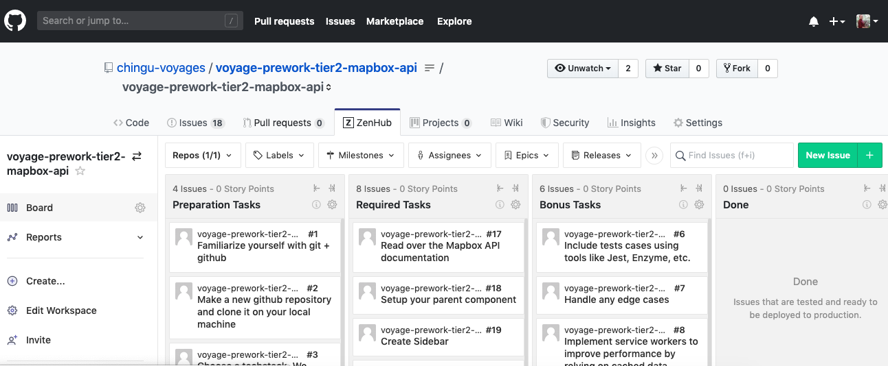

# Chingu Voyage Pre-work Project (Tier 2): Mapbox API

## Overview
This project helps you gain experience in using API's to enhance your applications.
Your objective with this project is to build a web application using the 
Mapbox API to build a map of a city of your choice.

## Instructions

General instructions for all Pre-Work Projects are located in the Chingu Voyage Handbook (URL posted in the
`#prework-community-news channel` on Discord). For detailed requirements checkout the ZenHub Board that is part of this repo.

To see the ZenHub tab on the GitHub repo webpage requires that you install ZenHub's browser extension. For more
information and installation instructions visit [ZenHub Browser Extension](https://www.zenhub.com/extension).

Good Luck!!!
